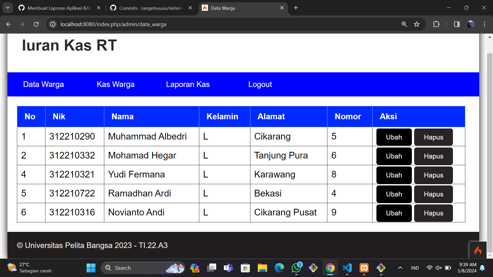

| NIM       | Anggota                      | GitHub                           |
| --------- | ---------------------------- | -------------------------------- |
| 312210293 | Muhammad Din Al Ayubi        | https://github.com/mdinalayubi   |
| 312210332 | Mohamad Hegar Sukmana Wibowo | https://github.com/hegarr        |
| 312210321 | Yudi Fermana                 | https://github.com/yudifermana   |
| --------- | ---------------------------- | -------------------------------- |
| Kelas     | TI.22A.3                     |
| Tugas     | Pemograman Web 1 UAS         |

# APLIKASI IURAN KAS RT
Menggunakan CoIgniter Dan Gitbash Atau Terminal Di Visual Studio Code
## Clone repository
```
https://github.com/mdinalayubi/uasweb.git
```
## Pindah ke directory iuran_kas
```
cd kasrt
```
## Instal Composer
* [composer_install](https://getcomposer.org/Composer-Setup.exe)
## Jalankan Aplikasi
```
php spark serve
```
## buka browser dengan alamat address ```http://localhost:8080/```
| [Demo-on](https://mdinalayubi.000webhostapp.com/) | [YouTube](https://youtu.be/l2uwNN3oBeQ?si=4atDyUh7bAoHUQto) | [Laporan](https://drive.google.com/drive/folders/1amnZaZc-E97ImFf4qwkIFln4yH0ZySQy?usp=drive_link)
## Hasil Output




