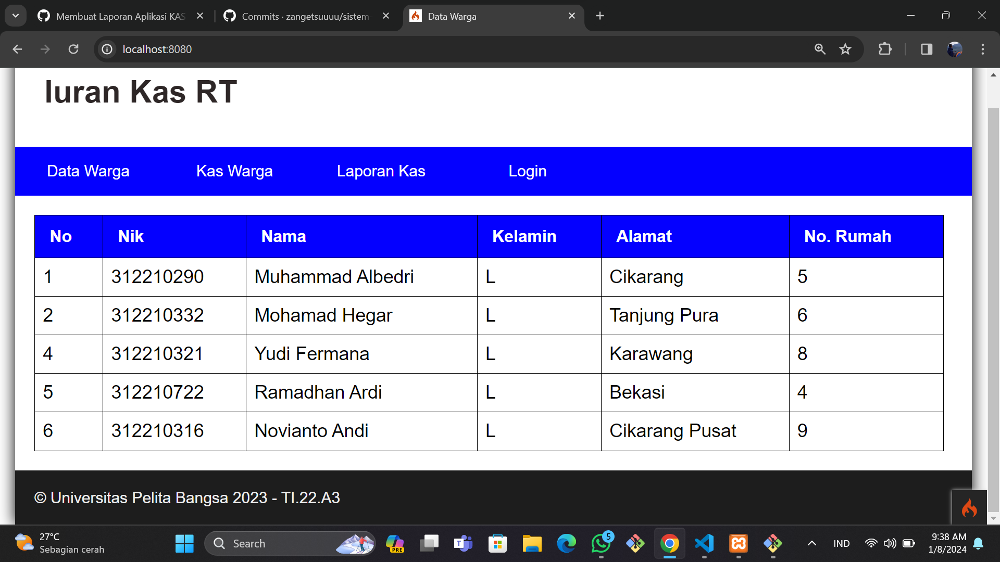

| Nama      | Muhammad Din Al Ayubi |
| ----------- | ----------- |
| NIM     | 312210293       |
| Kelas   | TI.22.A.3        |
| Tugas   | UAS Pemograman Web        |

# APLIKASI IURAN KAS RT
Menggunakan CoIgniter Dan Gitbash Atau Terminal Di Visual Studio Code
## Clone repository
```
https://github.com/mdinalayubi/uasweb.git
```
## Pindah ke directory iuran_kas
```
cd kasrt
```
## Instal Composer
* [composer_install](https://getcomposer.org/Composer-Setup.exe)
## Jalankan Aplikasi
```
php spark serve
```
## buka browser dengan alamat address ```http://localhost:8080/```
| [Demo-on](https://mdinalayubi.000webhostapp.com/) | [YouTube](https://youtu.be/lcaYCRReqBY)
## Laporan Iuran Kas RT : ```https://drive.google.com/drive/folders/1amnZaZc-E97ImFf4qwkIFln4yH0ZySQy?usp=drive_link```
## Hasil Output


